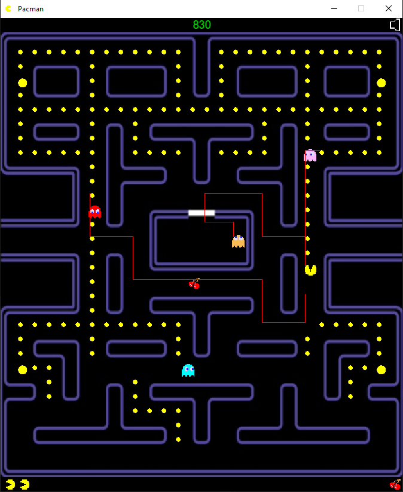

# Pacman

  

 A Pacman arcade game clone.

## Getting Started

### Prerequisites
* C++17 flag
* SFML library [SFML](https://github.com/SFML/SFML)

### Current Features
* A* pathfinding & classic game style pathfinding.
* Semi-classic game logic (see limitations section).

### Controls
* 'w','a','s','d' for Pacman movement.
* 'space' for starting/restarting level.
* '+','-' or mouse scroll wheel for volume control.
* 'm' or clicking sound icon for toggling mute.
* 'Esc' for exiting.

### In Progress

### Current Limitations/Issues
* No frame time smooth movement.
* Entity speed is static between levels.
* Ghosts do not speed through to their home when eaten but rather go there slowly.
* Ghosts 'flash' during the whole being hunted phase rather than the last couple of seconds.
* Ghosts cannot use the tunnel (normally they can at reduced speed). Rare crash when they get stuck there since they cannot reverse.
* Ghost house is not inaccessible during normal mode.

## Authors

* **Dimitrios Kazakos** - *Initial work* - [Gast91](https://github.com/Gast91)

## License

This project is licensed under the MIT License - see the [LICENSE.md](LICENSE.md) file for details
